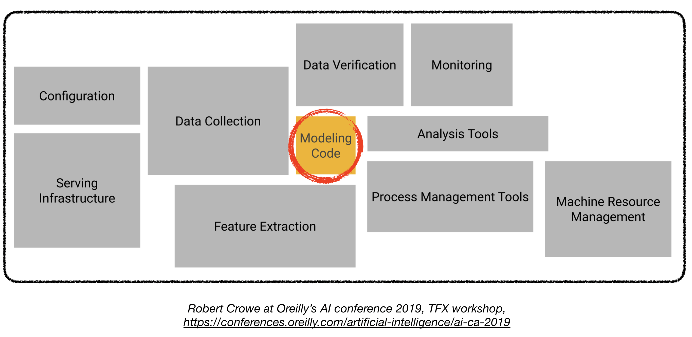
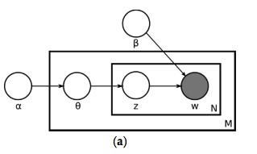

1. [General Coding Interview (Algorithms and Data Structures)](#coding)
2. [ML/Data Coding](#ml-coding)
3. [ML Depth](#depth)
3. [ML Breadth](#breadth)
5. [Machine Learning System Design](#ml-sys)

#  1. General Coding Interview (Algorithms and Data Structures) :computer: 

As an ML engineer, you're first expected to have a good understanding of general software engineering concepts, and in particular, basic algorithms and data structure.

Depending on the company and seniority level, there are usually one or two rounds of general coding interviews. The general coding interview is very similar to SW engineer coding interviews, and one can get prepared for this one same as other SW engineering roles.

## Leetcode

At this time, [leetcode](https://leetcode.com/) is the most popular place to practice coding questions. I practiced with around 350 problems, which were roughly distributed as **55% Medium, 35% Easy, and 15% Hard** problems. You can find some information on the questions that I practiced in [Ma Leet Sheet](https://docs.google.com/spreadsheets/d/1A8GIgCIn7gvnwE-ZBymI-4-5_ZxQfyeQu99N6f5gEGk/edit#gid=656844248) - Yea I tried to have a little bit fun with it here and there to make the pain easier to carry :D (I will write on my approach to leetcode in the future.)

#  2. ML/Data Coding
ML coding module may or may not exist in particular companies interviews. The good news is that, there are a limited number of ML algorithms that candidates are expected to be able to code. The most common ones include:
- k-means clustering
- k-nearest neighbors
- Decision trees
- Perceptron, MLP
- Linear regression
- Logistic regression
- SVM
- Sampling
  - stratified sampling
  - uniform sampling
  - reservoir sampling
  - sampling multinomial distribution
  - random generator
- NLP algorithms (if that's your area of work)
  - bigrams
  - tf-idf

#  4. ML Breadth/Fundamentals
As the name suggests, this interview is intended to evaluate your general knowledge of ML concepts both from theoretical and practical perspectives. Unlike ML depth interviews, the breadth interviews tend to follow a pretty similar structure and coverage amongst different interviewers and interviewees.

The best way to prepare for this interview is to review your notes from ML courses as well some high quality online courses and material. In particular, I found the following resources pretty helpful.

## Courses and review material:
- [Andrew Ng's Machine Learning Course](https://www.coursera.org/learn/machine-learning) (you can also find the [lectures on Youtube](https://www.youtube.com/watch?v=PPLop4L2eGk&list=PLLssT5z_DsK-h9vYZkQkYNWcItqhlRJLN) )
- [Structuring Machine Learning Projects](https://www.coursera.org/learn/machine-learning-projects)
- [Udacity's deep learning nanodegree](https://www.udacity.com/course/deep-learning-nanodegree--nd101) or  [Coursera's Deep Learning Specialization](https://www.coursera.org/specializations/deep-learning) (for deep learning)

If you already know the concepts, the following resources are pretty useful for a quick review of different concepts:
- [StatQuest Machine Learning videos](https://www.youtube.com/watch?v=Gv9_4yMHFhI&list=PLblh5JKOoLUICTaGLRoHQDuF_7q2GfuJF)
- [StatQuest Statistics](https://www.youtube.com/watch?v=qBigTkBLU6g&list=PLblh5JKOoLUK0FLuzwntyYI10UQFUhsY9) (for statistics review - most useful for Data Science roles)
- [Machine Learning cheatsheets](https://ml-cheatsheet.readthedocs.io/en/latest/)
- [Chris Albon's ML falshcards](https://machinelearningflashcards.com/)

Below are the most important topics to cover:
## 1. Classic ML Concepts

### ML Algorithms' Categories
  - Supervised, unsupervised, and semi-supervised learning (with examples)
    - Classification vs regression vs clustering
  - Parametric vs non-parametric algorithms
    - Examples of parametric algorithms (model form is fixed, find coefficients):
      - Regression
      - Logistic regression
      - Linear Discriminant Analysis
    - Examples of non-parametric algorithms:
      - Support Vector Machines
      - Decision Trees
  - Linear vs Nonlinear algorithms

### Supervised learning
  - Linear Algorithms
    - Linear regression
      - Least squares, residuals, linear vs multivariate regression
    - Logistic regression
      - Cost function (equation, code), sigmoid function, cross entropy
        - What is the difference between $L_1$ (Lasso) and $L_2$ (Ridge) regularization?
          - $$\text{L1 cost} = \sum_{i=0}^{N}(y_i - \sum_{j=0}^{M}x_{ij}W_j)^2 + \lambda\sum_{j=0}^{M}\left\vert{W_j}\right\vert$$
          - $$\text{L2 cost} = \sum_{i=0}^{N}(y_i - \sum_{j=0}^{M}x_{ij}W_j)^2 + \lambda\sum_{j=0}^{M}W_j^2$$
          - $L_1$ uses the absolute of the weights $W_j$ whereas $L_2$ uses the squared value of $W_j$.
          - $L_1$ estimates **median** of the data whereas $L_2$ estimates **mean**.
          - From gradient descent POV, $L_1$ will constantly penalize until $W=0$, whereas $L_2$ decreasing gradient will penalize less and less approaching 0.
          - $L_1$ regularization in feature selection helps to eliminate unimportant features due to its sparse estimates nature.
      - Binary cross-entropy = Cross-entropy with $C = 2$.
        - $$\text{CE} = - \sum_{t}^{C}t_i\log(s_i) \\
        \text{BCE} = - \sum_{t=1}^{C=2}t_i\log(s_i) = -t_1\log(s_1) - t_2\log(s_2) $$
        - Substitute $t_2 = 1 - t_1, s_2 = 1 - s_1$
        - $$\text{BCE} = -t_1\log(s_1) - (1-t_1)\log(1-s_1)$$
    - Support Vector Machines
      - Hard margin, term used when data is **linearly** separable.
        - $\text{Margin distance} = \frac{2}{\left\Vert w \right\Vert}$
        - $\min_{w} \left\Vert{w}\right\Vert^2$ subject to $y_i(w^Tx_i + b) \geq 1$ for $i = 1\dots N$
      - Soft margin, term used when data is **not linearly** separable.
        - *Hinge loss* function is used: $\max(0, 1-y_i(w^Tx_i - b))$, where $y_i$ is the raw output of the classifier i.e. probability.
        - Goal is to minimize: 
        $$\left[\frac{1}{n}\sum_{i=1}{N}\max(0, 1-y_i(w^Tx_i - b))\right] + \lambda\left\Vert w \right\Vert^2$$
    - Linear discriminant analysis

  - Decision Trees
    - Features are selected through the "*Information gain*" metric
      - A feature that splits the classes purely is one of high information gain
    - Logits
    - Leaves
    - Training algorithm
      - stop criteria
    - Inference
    - Pruning
      - Techniques: Top-down or bottom-up methods
      - Algorithms:
        - *Reduced error pruning*: Starting at the leaves, each node is replaced with its most popular class and the prediction accuracy is checked. If it is not affected, the change is kept and the process is repeated.
        - *Cost complexity pruning*: A error rated is chosen. Next start removing a subtree such that it minimizes the error introduced. The best tree is kept based on the cross-validation set.

  - Ensemble methods
    - Bagging and boosting methods (with examples)
    - Random Forest
      - Ensemble?
      - *Classification*: Each decision tree is allowed a vote and the class with the most votes is the prediction.
      - *Regression*: Each decision tree generates an individual prediction and the average is taken as the final prediction.
      - **Uncorrelatedness** is important for random forests else it is as good as a single decision tree.
      - Methods to decorrelate trees i.e. **RANDOM** part of **RANDOM** Forests:
        - **[Subset of rows]** Bootstrap aggregating / Bagging: Each tree gets to sample a subset of the training data with replacement, where some examples are repeated. Then the output is combined through a process called "bootstrap aggregating" or "bagging".
        - **[Subset of columns]** Feature randomness: Each tree gets to see a subset of the features for training.

    - Boosting
      - Adaboost
      - GBM
      - XGBoost
        - What is XGBoost?
          - Speed and performance through parallelization
          - Differs from Random Forest by how the individual trees are built and in the way the results are combined.
          - Boosting?
            - Combines weak learners sequentially, each new tree corrects the errors of the previous one.
            - $$F(2) = F(1) + \eta \cdot \text{Second tree}$$
            where 
            $$\text{Second tree} = - \frac{\partial L}{\partial F(1)} = - \frac{\partial \text{Loss function}}{\partial \text{Previous model's output}}$$
        - | Parameters | Description |
          | :--- | :--- |
          | alpha $\alpha$ | $L_1$ regularization |
          | lambda $\lambda$ | $L_2$ regularization |
          | gamma $\gamma$ | Minimum loss reduction to make further parition on a leaf node |
          | eta $\eta$ | Learning rate |
          | max_depth | Maximum depth of the tree, increasing this will increases model complexity and tendency to overfit |
          | subsample | Range (0, 1] subsamples training data prior to growing trees, prevents overfitting |

  - Comparison of different algorithms
    - [TBD: LinkedIn lecture]

  - Optimization
    - Gradient descent (concept, formula, code)
    - Other variations of gradient descent
      - SGD
      - Momentum
      - RMSprop
      - ADAM
  - Loss functions
    - Logistic Loss function
      - $$\text{Cost}(h_\theta(x), y) = -y\log(h_\theta(x)) - (1-y)\log(h_\theta(x))$$
      - Overall loss over all samples:
      $$ J(\theta) = \frac{1}{m} \left[\sum_{i=1}^{M}-y^{(i)}\log(h_\theta(x^{(i)})) + (1-y^{(i)})\log(h_\theta(x^{(i)})) \right] $$ 
    - Cross Entropy (remember formula as well)
      - $$\text{CE} = - \sum_{t}^{C}t_i\log(s_i) \\
        \text{BCE} = -t_1\log(s_1) - (1-t_1)\log(1-s_1) $$
    - Hinge loss (SVM)
      - $\max(0, 1-y_i(w^Tx_i - b))$

- Feature selection/importance
  - In feature selection we aim to select features that are highly dependent on the response
  - Methods
    - Chi-square test: Given a distribution we can get the observed and expected counts and check their deviation from each other.
    - Tree models: 

- Imbalanced classes
  - Sampling, undersampling and oversampling
  - Artificially generated samples

- Model evaluation and selection
  - Evaluation metrics
    - 

      
      

    - Precision: 
    $$\text{Precision} = \frac{TP}{TP + FP}$$
    - Recall: 
    $$\text{Recall} = \frac{TP}{TP + FN}$$
    - Confusion matrix
    - Accuracy, precision, recall/sensitivity, specificity, F-score
      - how do you choose among these? (imbalanced datasets)
      - precision vs TPR (why precision)
    - ROC curve (TPR vs FPR, threshold selection)
    - AUC (model comparison)
    - PR AUC vs ROC: 
    > I think intuitively you can say that if your model needs to perform equally well on the positive class as the negative class for example, for classifying images between cats and dogs, you would like the model to perform well on the cats as well as on the dogs. For this you would use the ROC AUC. 
    >
    > On the other hand, if you're not really interested in how the model performs on the negative class, but just want to make sure every positive prediction is correct (precision), and that you get as many of the positives predicted as positives as possible (recall), then you should choose PR AUC. For example, for detecting cancer, you don't care how many of the negative predictions are correct, you want to make sure all the positive predictions are correct, and that you don't miss any. (In fact, in this case missing a cancer would be worse then a false positive so you'd want to put more weight towards recall.)
    - Extension of the above to multi-class (n-ary) classification
    - algorithm specific metrics [TBD]
  - Model selection
    - Cross validation
      - k-fold cross validation (what's a good k value?)
- Time Series
  - Attention mechanisms
    - 
  - PACF and ACF
    - ACF refers to the Autocorrelation function

### Unsupervised learning
  - Clustering
    - Centroid models: k-means clustering
    - Connectivity models: Hierarchical clustering
    - Density models: DBSCAN
  - Gaussian Mixture Models
  - Latent semantic analysis
  - Hidden Markov Models (HMMs)
    - Markov processes
    - Transition probability and emission probability
    - Viterbi algorithm [Advanced]
  - Dimension reduction techniques
    - Principal Component Analysis (PCA)
    - Independent Component Analysis (ICA)
    - T-SNE

### Bias / Variance (Underfitting/Overfitting)
- Regularization techniques
  - L1/L2 (Lasso/Ridge)
### Sampling
- sampling techniques
  - Uniform sampling
  - Reservoir sampling
  - Stratified sampling
### Missing data
 - [TBD]
### Time complexity of ML algorithms
- [TBD]

## 2. Deep learning
- Feedforward NNs
  - In depth knowledge of how they work
  - [EX] activation function for classes that are not mutually exclusive
- RNN
  - backpropagation through time (BPTT)
  - vanishing/exploding gradient problem
- LSTM
  - Vanishing gradient problem
  > No issue when having shallow networks but when you have complex and deep networks, activation functions like "sigmoid" will produce small gradients that make training difficult. 
  > Solution: use activation layers like ReLU where the gradient is constant past the origin or use residual or skip connections
  - Skip or residual connections
     - Allow gradient to flow through the  network directly without passing through the non-linear activation function.
     - Network can learn the identity function directly.
     - "Residual" term is used as since the identity function is propagated, what is left to learn is the "residual".
     - Helps to complex networks learn simple functions and prevent "degradation". "Degredation" occurs when a complex network starts to underperform simpler networks.
- Dropout
  - LSTM and dropout: It might be unwise to add dropouts to LSTMs as there is a chance of forgetting something. Better to put dropout after dense layers.
- Seq2seq models
- Attention
  - self-attention
- Transformer and its architecture (in details, yes, no kidding! I was asked twice! In an ideal world, I wouldn't answer those detailed questions to anyone except the authors and teammates, as either you've designed it or memorized it!)
- Embeddings (word embeddings)

## 3. Statistical ML
###  Bayesian algorithms
  - Naive Bayes
  - Maximum a posteriori (MAP) estimation
  - Maximum Likelihood (ML) estimation
### Statistical significance
- R-squared
- P-values

## 4. Other topics:
  - Central Limit Theorem
    > If you take a distribution of spending per customer, it would probably look like a Poisson distribution. If you take that customer's mean and plot it with the mean of another 1000 customers, the distribution of means will look normal.
  - Outliers
  - Similarity/dissimilarity metrics
    - Euclidean, Manhattan, Cosine, Mahalanobis (advanced)

#   5. Machine Learning System Design

## Designing ML systems for production
This is one of my favorite interviews in which you can shine bright and up-level your career. I'd like to mention the following important notes:

- Remember, the goal of ML system design interview is NOT to measure your deep and detailed knowledge of different ML algorithms, but your ability to zoom out and design a production-level ML system that can be deployed as a service within a company's ML infrastructure.

- Deploying deep learning models in production can be challenging, and it is beyond training models with good performance. Several distinct components need to be designed and developed in order to deploy a production level deep learning system.

- For more insight on different components above you can check out the following resources):
  - [Full Stack Deep Learning course](https://fall2019.fullstackdeeplearning.com/)
  - [Production Level Deep Learning](https://github.com/alirezadir/Production-Level-Deep-Learning)
  - [Machine Learning Systems Design](https://github.com/chiphuyen/machine-learning-systems-design)
  - Stanford course on ML system design [TBA]

Once you learn about the basics, I highly recommend checking out different companies blogs on ML systems, which I learnt a lot from. You can refer to some of those resources in the subsection [ML at Companies](#ml-at-companies) below.

## ML System Design Flow
Approaching an ML system design problem follows a similar flow to the generic software system design.
For more insight on general system design interview you can e.g. check out:
- [Grokking the System Design Interview
](https://www.educative.io/courses/grokking-the-system-design-interview)
- [System design primer](https://github.com/donnemartin/system-design-primer)

Below is a design flow that I would recommend:

1. Problem Description
    - What does it mean? 
    - Use cases 
    - Requirements
    - Assumptions 
2. Do we need ML to solve this problem? 
    - Trade off between impact and cost
      - Costs: Data collection, data annotation, compute 
    - if Yes, go to the next topic. If No, follow a general system design flow. 
3. ML Metrics 
      - Accuracy metrics: 
          - imbalanced data?
      - Latency 
      - Problem specific metric (e.g. CTR)
4. Data
    - Needs 
        - type (e.g. image, text, video, etc) and volume
    - Sources
        - availability and cost 
    - Labelling (if needed)
      - labeling cost  
5. MVP Logic 
    - Model based vs rule based logic 
        - Pros and cons, and decision 
          -  Note: Always start as simple as possible and iterate over 
    - Propose a simple model (e.g. a binary logistic regression classifier)
    - Features/ Signals (if needed)
      - what to chose as and how to chose features 
      - feature representation 
6. Training (if needed)
      - data splits (train, dev, test)
        - portions
        - how to chose a test set 
      - debugging 
    - Iterate over MVP model (if needed)
      - data augmentation  
7. Inference (online)
    - Data processing and verification 
    - Prediction module 
    - Serving infra 
    - Web app 
8. Scaling
  - Scaling for increased demand (same as in distributed systems)
      - Scaling web app and serving system 
      - Data partitioning 
  - Data parallelism 
  - Model parallelism 
9. A/B test and deployment
    - How to A/B test? 
      - what portion of users?
      - control and test groups 
10. Monitoring and Updates 
    - seasonality   

## ML System Design Topics
I observed there are certain sets of topics that are frequently brought up or can be used as part of the logic of the system. Here are some of the important ones:

### Recommendation Systems
- Collaborative Filtering (CF)
    - user based, item based
    - Cold start problem
    - Matrix factorization
- Content based filtering

### NLP

- Preprocessing
  - Normalization:
    - Tokenization: Process of splitting a sentence into words, characters or subwords
    - Stop words: Commonly used words that are ignored as they don't add value to understanding.
    - Lemmatization: A lemma is a canonical form, dictionary form or a citation for of a set of words. Convert all words that has the same meaning to its lemma.
    - Stemming: Reducing a word to its root form, e.g. stopping to stop
    - Expanding contractions e.g. convert we'll to we will
    - Removing punctuations
    - POS tagging: Task of assigning each word a tag e.g. noun, verb, adjective, adverb etc

- Word Embeddings
  - Word2Vec, GloVe, ElMo, BERT
  - Word2Vec vs GloVe
    - Both models learn **geometrical** encodings (vectors) of words from their co-occurrence information (how frequently they appear in large text corpora).
    - Word2Vec is a "predictive" model whereas GloVe is a "count-based" model.
    - Predictive models learn their vector representations by minimizing loss, in Word2Vec this is done through a **feed-forward** network.
    - Count-based models learn their vectors by doing dimensionality reduction on the co-occurence counts matrix. For each word (row), we count how frequently it is seen in a context (column). Then this giant matrix is factorized to a lower dimension matrix while preserving the reconstruction loss.
  - Pre-trained word embeddings like Word2Vec and GloVe cannot change a representation of a word even though its meaning changes according to context. i.e. present: gift, present: now
  - ELMo
    - ELMo will change the vector representation of a word according to context. Dynamic encoding based on context.
    - ELMo uses a bidirectional LSTM, higher level layers capture **context** while lower level layers capture **syntax**.
    - First CNN layer of ELMo uses "**character embedding**" to make it context independent
    - LSTMs on later layers incorporate a skip or residual connection to learn from earlier layers well and to prevent the gradient vanishing issue.
    - Forward LSTMs will help to predict future words while backward LSTMs will help with previous words.
    - Vectors from back and forward LSTMs are concatenated and normalized using weights obtained during training. The final representation is the sum of all layers hence it includes both **syntax** and **context** information.
    - $\gamma$ is to aid optimization process.
  - BERT
    - BERT is a form of self-supervised learning. 
    - During pre-training, 80% of the time it randomly masks a word in a sentence, 10% of the time it will substitute it with another and the other 10% leave it unchanged. It also will add steps to predict the next sentence.
    - This helps BERT to predict the next word and with question answering tasks.
    - Dot Product Attention/[`Self attention`](#self-attention).
    - Types of BERT models:
      - BERT Base: $L=12, H=768, A=12$
      - BERT Large: $L=24, H=1024, A=16$
      - $L$: Transformer blocks
      - $H$: Hidden dimension embedding
      - $A$: Bidirectional self-attention heads
- Attention Mechanisms
  -  Self-attention
  - | Sentence: | Bank | of | the | river|
    | :--- | :---: | :---: | :---: | :---: |
    | Word vector: | $v_1$ | $v_2$ | $v_3$ | $v_4$ |
    | Reweighing: | $\mathbf{\bar{w}}_1 \mathbf{v}$ | $\mathbf{\bar{w}}_2 \mathbf{v}$ | $\mathbf{\bar{w}}_3 \mathbf{v}$ | $\mathbf{\bar{w}}_4 \mathbf{v}$ |
    | Output: | $y_1$ | $y_2$ | $y_3$ | $y_4$ |
  - $v_1 \cdot v_1 = w_{11} \rightarrow \text{normalized} \rightarrow \bar{w}_{11}$  
    $v_1 \cdot v_2 = w_{12} \rightarrow \text{normalized} \rightarrow \bar{w}_{12}$  
    $v_1 \cdot v_3 = w_{13} \rightarrow \text{normalized} \rightarrow \bar{w}_{13}$  
    $v_1 \cdot v_4 = w_{14} \rightarrow \text{normalized} \rightarrow \bar{w}_{14}$  
    $\bar{w}_{11}v_1 + \bar{w}_{12}v_2 + \bar{w}_{13}v_3 + \bar{w}_{14}v_4 = y_1 \rightarrow \mathbf{\bar{w}}_1 \mathbf{v}$ 
  - This reweighing helps to form linkages with words within the sentence.
- Topic Modelling
  - Latent Dirichlet Allocation
    - Documents with similar topics will use similar groups of words
    - Documents are probability distributions over latent topics
    - Topics are probability distributions over words
    - Plate notation is a concise way of visually representing the dependencies among the model parameters 
  

    - | Parameter | Description |
      | :--- | :--- |
      | $M$ | Total number of documents |
      | $N$ | Total number of words in a document |
      | $\alpha$ | is the parameter of the Dirichlet prior on the per-document topic distribution, a high $\alpha$ indicates each document has a high mixture topics |
      | $\beta$ | is the parameter of the Dirichlet prior on per-topic word distribution, a high $\beta$ indicates that each topic will contain a mixture of most of the words |
      | $\theta_m$ | Topic distribution for document $m$ |
      | $z_{mn}$ | is the topic of the $n^\text{th}$ word of document $m$ |
      | $w_{mn}$ | is the specific word |
    Parameters exists within a rectangle indicates their belonging to the entity
    - LDA assumes that each document is created using a `Generative Process`
      - Determine number of words in a document
      - Choose a topic mixture from a fixed set of topics e.g. (20% topic A, 30% topic B...)
      - Generate words in the document by:
        - First pick a topic based on the document's multinomial distribution above
        - Next pick a word from the topic's multinomial distribution
    - Summary: LDA takes a number of documents. It assumes that the words in each document are related. It then tries to figure out the "recipe" for how each document could have been created. We just need to tell the model how many topics to construct and it uses that "recipe" to generate the topic and word distributions over a corpus. Based on that output, we can identify similar documents within the corpus.
    - | Advantages | Limitations |
      | :--- | :--- |
      | LDA is an effective tool for topic modeling | Must know the number of topics K in advance |
      | Easy to understand conceptually | Dirichlet topic distribution cannot capture correlations among topics |
      | Has been shown to produce good results over many domains | |
      | New applications | |
  

- Text classification and sentiment analysis
- NLP specialist topics:
  - Language Modeling
  - Part of speech tagging
  - POS HMM
    - Viterbi algorithm and beam search
  - Named entity recognition
  - Topic modeling
  - Speech Recognition Systems
    - Feature extraction, MFCCs
    - Acoustic modeling
      - HMMs for AM
      - CTC algorithm (advanced)
    - Language modeling
      - N-grams vs deep learning models (trade-offs)
      - Out of vocabulary problem
  - Dialog and chatbots
    - [CMU lecture on chatbots](http://tts.speech.cs.cmu.edu/courses/11492/slides/chatbots_shrimai.pdf)
    - [CMU lecture on spoken dialogue systems](http://tts.speech.cs.cmu.edu/courses/11492/slides/sds_components.pdf)
  - Machine Translation
    - Seq2seq models, NMT

Note: The reason I have more topics here is because this was my focus in my own interviews

### Ads and Ranking
- CTR prediction
- Ranking algorithms

### Information retrieval
- Search
  - Pagerank
  - Autocomplete for search

### Computer vision
- Image classification
- Object Tracking
- Popular architectures (AlexNet, VGG, ResNET)
- [TBD]

### Transfer learning
- Why and when to use transfer learning
- How to do it
  - depending on the dataset sizes and similarities

## ML Systems at Big Companies 
- AI at LinkedIn
  - [Intro to AI at Linkedin](https://engineering.linkedin.com/blog/2018/10/an-introduction-to-ai-at-linkedin)
  - [Building The LinkedIn Knowledge Graph](https://engineering.linkedin.com/blog/2016/10/building-the-linkedin-knowledge-graph)
  - [The AI Behind LinkedIn Recruiter search and recommendation systems](https://engineering.linkedin.com/blog/2019/04/ai-behind-linkedin-recruiter-search-and-recommendation-systems)
  - [A closer look at the AI behind course recommendations on LinkedIn Learning, Part 1](https://engineering.linkedin.com/blog/2020/course-recommendations-ai-part-one)
  - [A closer look at the AI behind course recommendations on LinkedIn Learning, Part 2](https://engineering.linkedin.com/blog/2020/course-recommendations-ai-part-two)
  - [Communities AI: Building communities around interests on LinkedIn](https://engineering.linkedin.com/blog/2019/06/building-communities-around-interests)
  - [Linkedin's follow feed](https://engineering.linkedin.com/blog/2016/03/followfeed--linkedin-s-feed-made-faster-and-smarter)
  - XNLT for A/B testing

- ML at Google
    - ML pipelines with TFX and KubeFlow
    - [How Google Search works](https://www.google.com/search/howsearchworks/)
      - Page Rank algorithm ([intro to page rank](https://www.youtube.com/watch?v=IKXvSKaI2Ko), [the algorithm that started google](https://www.youtube.com/watch?v=qxEkY8OScYY))
    - TFX production components
      - [TFX workshop by Robert Crowe](https://conferences.oreilly.com/artificial-intelligence/ai-ca-2019/cdn.oreillystatic.com/en/assets/1/event/298/TFX_%20Production%20ML%20pipelines%20with%20TensorFlow%20Presentation.pdf)
    - [Google Cloud Platform Big Data and Machine Learning Fundamentals](https://www.coursera.org/learn/gcp-big-data-ml-fundamentals)
- Scalable ML using AWS
  - [AWS Machine Learning Blog](https://aws.amazon.com/blogs/machine-learning/)
  - [Deploy a machine learning model with AWS Elastic Beanstalk](https://medium.com/swlh/deploy-a-machine-learning-model-with-aws-elasticbeanstalk-dfcc47b6043e)
  - [Deploying Machine Learning Models as API using AWS](https://medium.com/towards-artificial-intelligence/deploying-machine-learning-models-as-api-using-aws-a25d05518084)
  - [Serverless Machine Learning On AWS Lambda](https://medium.com/swlh/how-to-deploy-your-scikit-learn-model-to-aws-44aabb0efcb4)
-  ML at Facebook
   -  [Machine Learning at Facebook Talk](https://www.youtube.com/watch?v=C4N1IZ1oZGw)
   -  [Scaling AI Experiences at Facebook with PyTorch](https://www.youtube.com/watch?v=O8t9xbAajbY)
   -  [Understanding text in images and videos](https://ai.facebook.com/blog/rosetta-understanding-text-in-images-and-videos-with-machine-learning/)
   -  [Protecting people](https://ai.facebook.com/blog/advances-in-content-understanding-self-supervision-to-protect-people/)
   -  Ads
      - Ad CTR prediction
      - [Practical Lessons from Predicting Clicks on Ads at Facebook](https://quinonero.net/Publications/predicting-clicks-facebook.pdf)
   - Newsfeed Ranking
     - [How Facebook News Feed Works](https://techcrunch.com/2016/09/06/ultimate-guide-to-the-news-feed/)
     - [How does Facebook’s advertising targeting algorithm work?](https://quantmar.com/99/How-does-facebooks-advertising-targeting-algorithm-work)
     - [ML and Auction Theory](https://www.youtube.com/watch?v=94s0yYECeR8)
     - [Serving Billions of Personalized News Feeds with AI - Meihong Wang](https://www.youtube.com/watch?v=wcVJZwO_py0&t=80s)
     - [Generating a Billion Personal News Feeds](https://www.youtube.com/watch?v=iXKR3HE-m8c&list=PLefpqz4O1tblTNAtKaSIOU8ecE6BATzdG&index=2)
     - [Instagram feed ranking](https://www.facebook.com/atscaleevents/videos/1856120757994353/?v=1856120757994353)
     - [How Instagram Feed Works](https://techcrunch.com/2018/06/01/how-instagram-feed-works/)
   - [Photo search](https://engineering.fb.com/ml-applications/under-the-hood-photo-search/)
   - Social graph search
   - Recommendation
     - [Recommending items to more than a billion people](https://engineering.fb.com/core-data/recommending-items-to-more-than-a-billion-people/)
     - [Social recommendations](https://engineering.fb.com/android/made-in-ny-the-engineering-behind-social-recommendations/)
   - [Live videos](https://engineering.fb.com/ios/under-the-hood-broadcasting-live-video-to-millions/)
   - [Large Scale Graph Partitioning](https://engineering.fb.com/core-data/large-scale-graph-partitioning-with-apache-giraph/)
   - [TAO: Facebook’s Distributed Data Store for the Social Graph](https://www.youtube.com/watch?time_continue=66&v=sNIvHttFjdI&feature=emb_logo) ([Paper](https://www.usenix.org/system/files/conference/atc13/atc13-bronson.pdf))
   - [NLP at Facebook](https://www.youtube.com/watch?v=ZcMvffdkSTE)
-  ML at Netflix
   -  [Recommendation at Netflix](https://www.slideshare.net/moustaki/recommending-for-the-world)
   -  [Past, Present & Future of Recommender Systems: An Industry Perspective](https://www.slideshare.net/justinbasilico/past-present-future-of-recommender-systems-an-industry-perspective)
   -  [Deep learning for recommender systems](https://www.slideshare.net/moustaki/deep-learning-for-recommender-systems-86752234)
   -  [Reliable ML at Netflix](https://www.slideshare.net/justinbasilico/making-netflix-machine-learning-algorithms-reliable)
   -  [ML at Netflix (Spark and GraphX)](https://www.slideshare.net/SessionsEvents/ehtsham-elahi-senior-research-engineer-personalization-science-and-engineering-group-at-netflix-at-mlconf-sea-50115?next_slideshow=1)
   -  [Recent Trends in Personalization](https://www.slideshare.net/justinbasilico/recent-trends-in-personalization-a-netflix-perspective)
   -  [Artwork Personalization @ Netflix](https://www.slideshare.net/justinbasilico/artwork-personalization-at-netflix)

# Behavioral interviews
- **STAR** method
  - Situation: Set the scene and give the necessary details of your example.
  - Task: Describe what your responsibility was in that situation.
  - Action: Explain exactly what steps you took to address it.
  - Result: Share what outcomes your actions achieved.
